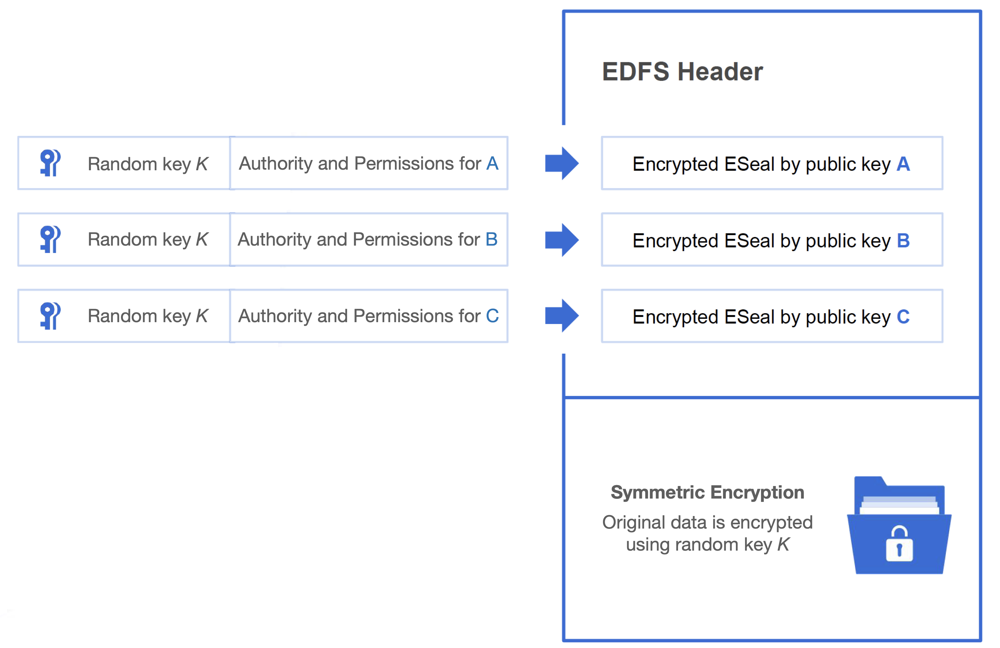

# Decentralized File Security

### ESeal

**The encryption structure of files is the core building block for enforcing security on files. Each file which is uploaded to Nela follows the following scheme:**

**Body -** The actual file is encrypted through symmetric encryption and a random key.

**Header -** The encrypted file contains with it a header, in which each identity's permissions as well as the body's random key are encrypted together using asymmetric encryption.

​Authority and permissions can be to the degree of what can be done with the file (view, edit, create a duplicate, etc.) to what Operating System is accepted or if a hardware device is required.Through this encryption scheme, permissions on files can be given by only having knowledge of a user's public key, setting the foundation of trust-less access control management within Nela's encrypted decentralized file system.

### Real-Time Encryption/Decryption

Nela's approach to file security boils down to the file level rather than the obfuscation of content behind paywalls and download access barriers. This allows for Nela to enforce the highest degree of control from the perspective of file owners.

**Files stay encrypted throughout their entire life-cycle.** That is, files are encrypted before they are uploaded to the network, through their delivery, during their use, and up until their destruction. The only identity able to turn the encrypted file back into its unencrypted form is the current permissioned owner of the encrypted file.

Just because a file is encrypted, does not mean it cannot be used. Nela's SDK provides an all encompassing range of tools for client-side real-time encryption and decryption of these encrypted files and are a product of global industry leaders in domains such as operating systems and file security.

Even as a downloaded file on an end user's terminal, files must assert that an identity is permissioned through a private key corresponding to an ESeal entry of the encrypted file's header. This process happens automatically and seamlessly from the end user's perspective. If permissioned, a file is decrypted in real-time directly to the application using it. Furthermore, for each operation in which the application interacts with the file (reading, copying, modifying, etc.), the user's permissions are asserted before decryption/encryption occurs. If it is the case the the operation is not valid, the software will redirect the process to maintain the integrity of the asset.

The real-time encryption and decryption software allows users to unlock their corresponding ESeals in order to access the file's random key. This, however, is done in a way that prevents the user

### Security Modules

#### DSFS & Security Sandbox

#### Local Service
